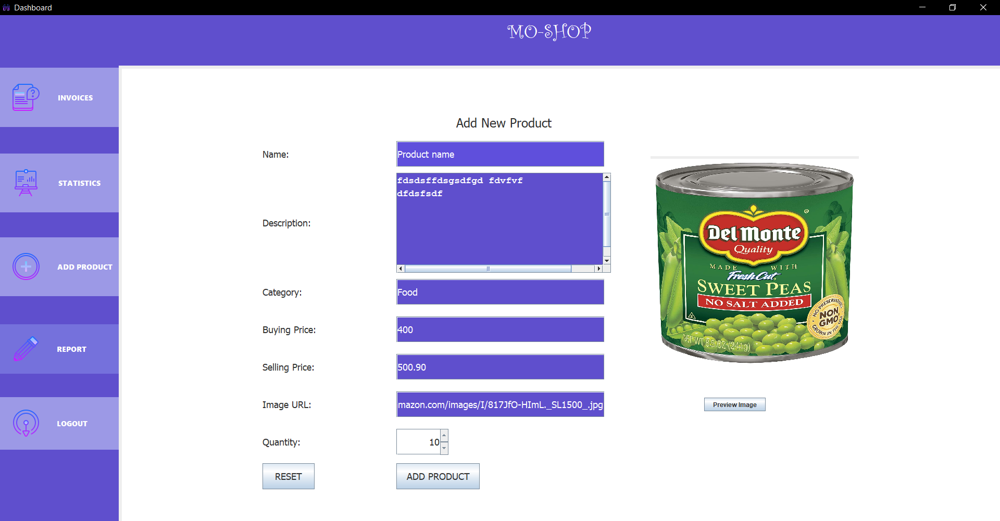
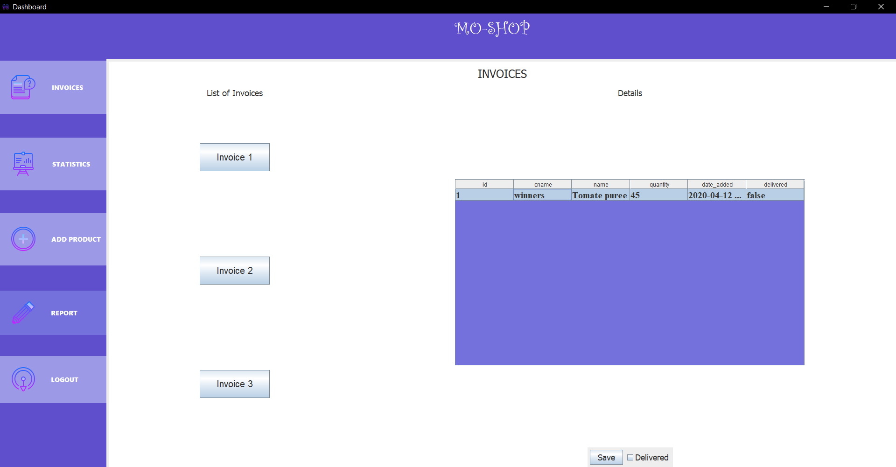
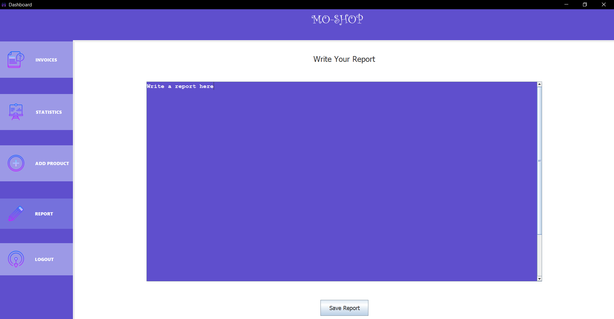
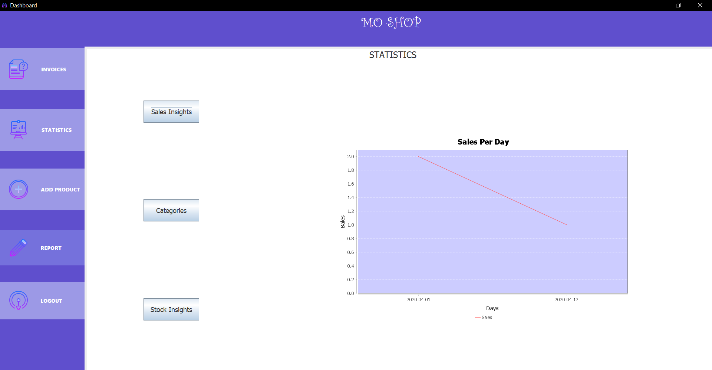
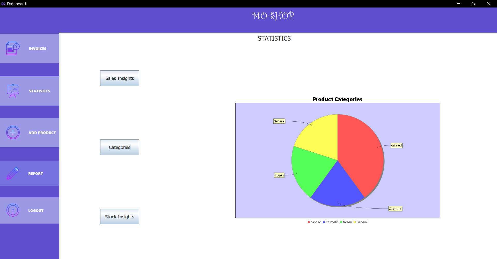
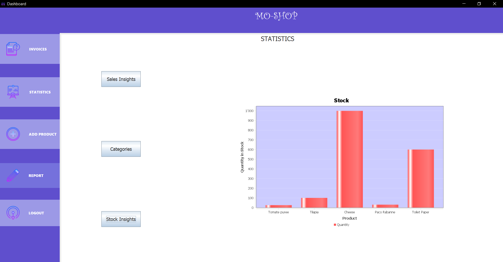

# Mo-Shop

Mo-Shop is an application where supermarkets can buy their products from
wholesalers. The wholesaler part was done by me as part of a group assignment where other team members worked on the supermarket side. This deliverable was for the module Software Modelling and Design from Year 2 of Applied Computing.

## Features

### 1.Add a product
> 
### 2.View Invoices
> 
### 3.Write Report
> 
### 4.Statistics Visualization
> 
> 
> 

## Libraries Used

> ### 1.JDBC
> ### 2.rs2xml
> ### 3.JFreeChart
